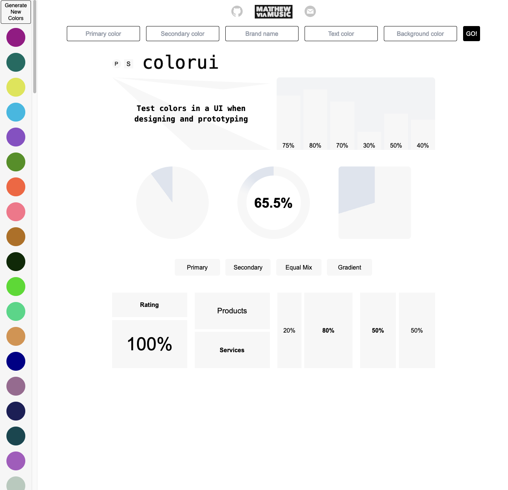
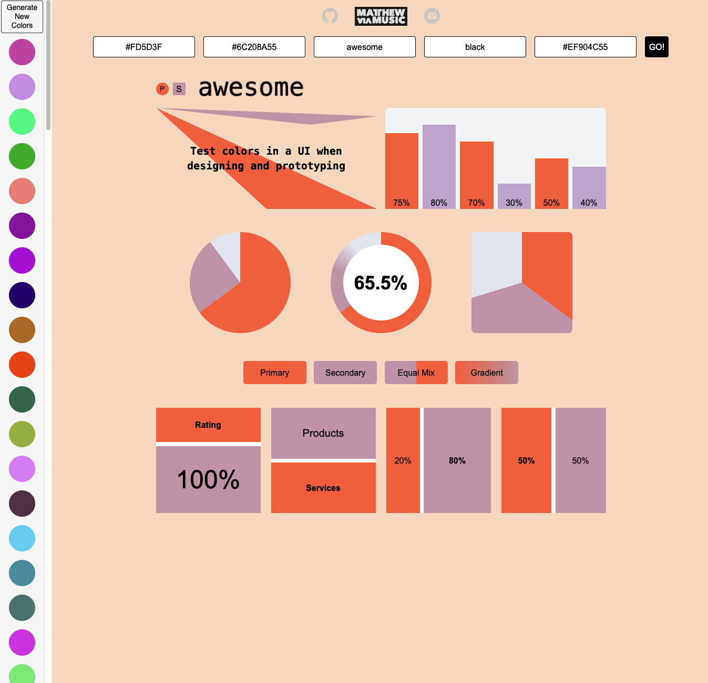

# colorui v.3.0

## Test colors in a User Interface when designing and prototyping.

[LIVE SITE](https://colorui.github.io/v3)

`Features a customised version of` [ColorCopy](https://colorcopy.github.io/)